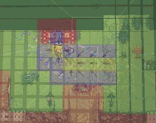

# RageTileMap <https://github.com/rakkarage/RageTileMap>

    +-+-+
    |2|3|
    +-+-+
    |0|1|
    +-+-+
    index = y * width + x

A simple tile map using unity and csharp.

It works by indexing tiles in a sprite sheet using an enum.

Features:

- Create maps with code or custom editor.
- Flip and rotate tiles.
- Animate tiles.
- Maximum of 126x126 (15876) tiles. (Thanks Obama!?)
- Tiled tmx csv import

New:

- Mini map.
- Path finding. (with path display in game (pooled animated prefabs) and in editor (arrow gizmos))
- Raycast light & fog of war.
- Pan map (with snap to screen & character) & pinch and mouse wheel zoom.
- Oriented and stretched background.

Graphics:

- <https://henrysoftware.itch.io/pixel-level-free>
- <https://henrysoftware.itch.io/pixel-level>

Interactive WebGL Demo:

- <https://henrysoftware.itch.io/rage-tile-map>

Credits:

- Thanks mizipzor! <https://github.com/mizipzor/UnityTileMap>
- Thanks quill18creates! <https://www.youtube.com/playlist?list=PLbghT7MmckI4qGA0Wm_TZS8LVrqS47I9R>
